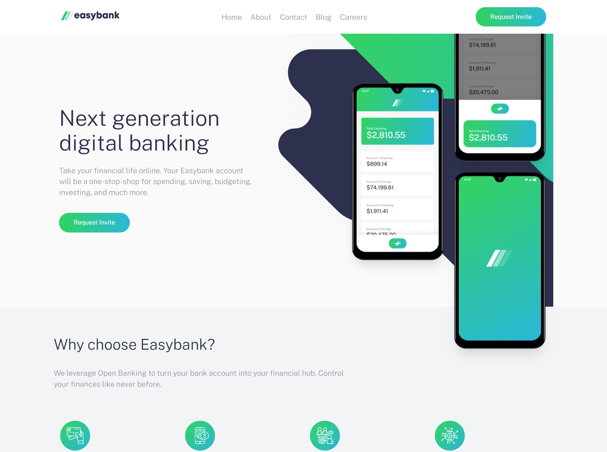
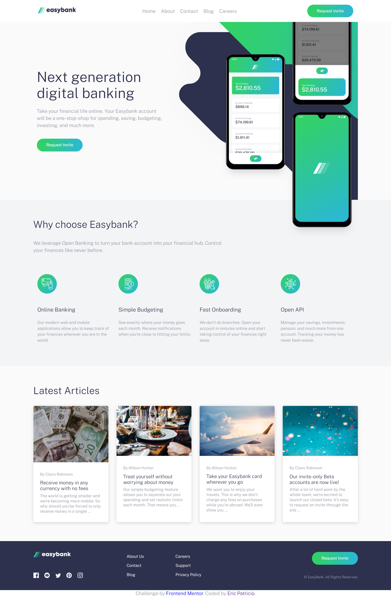

# Easybank landing page

- Frontend mentor challenge from [frontendmentor](https://www.frontendmentor.io)
- Landing page using css flexbox, css grid, sass css preprocessor and some JavaScript on hamburger menu

